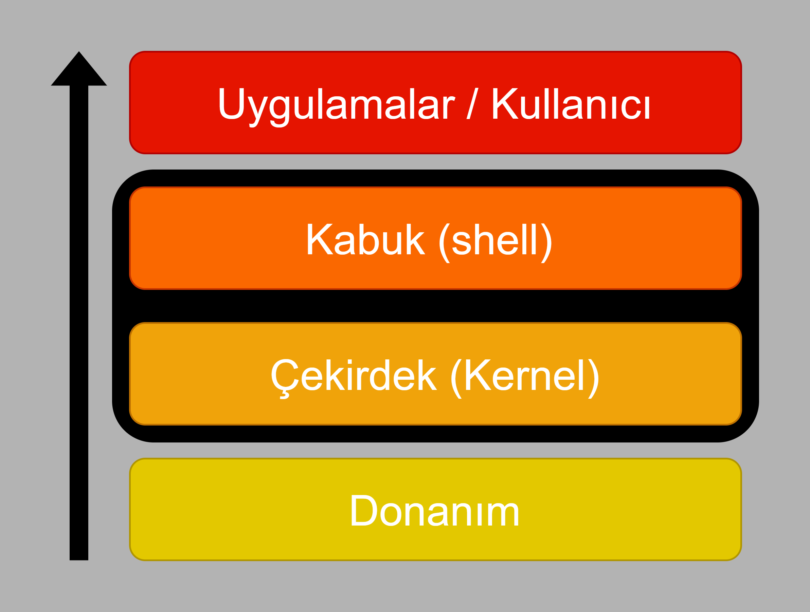
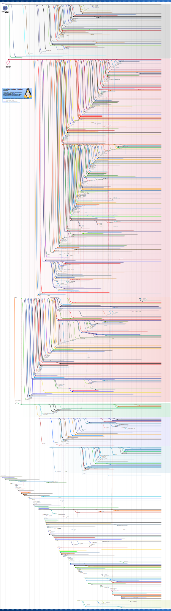
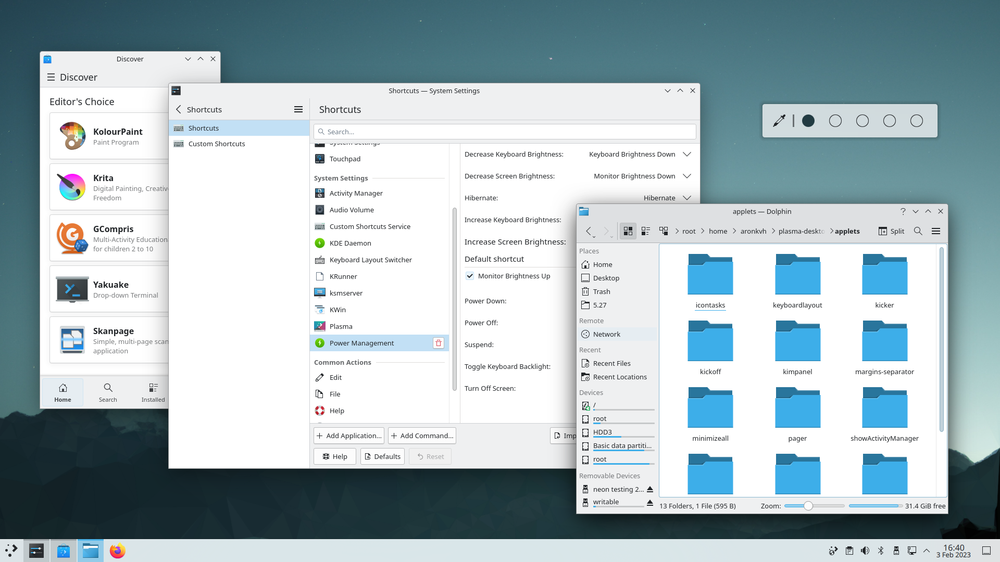
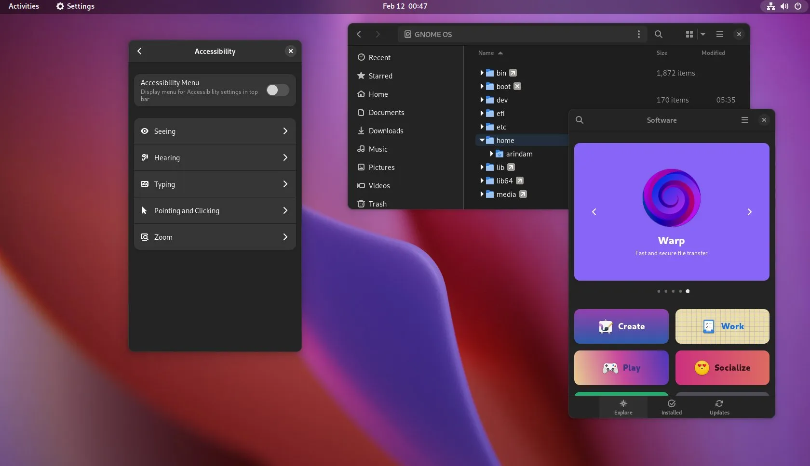
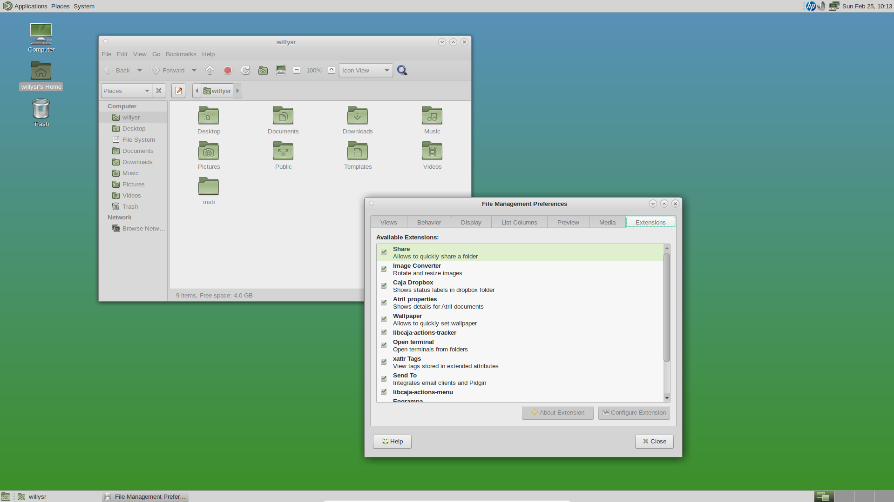
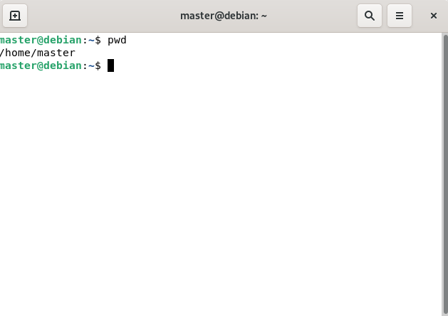
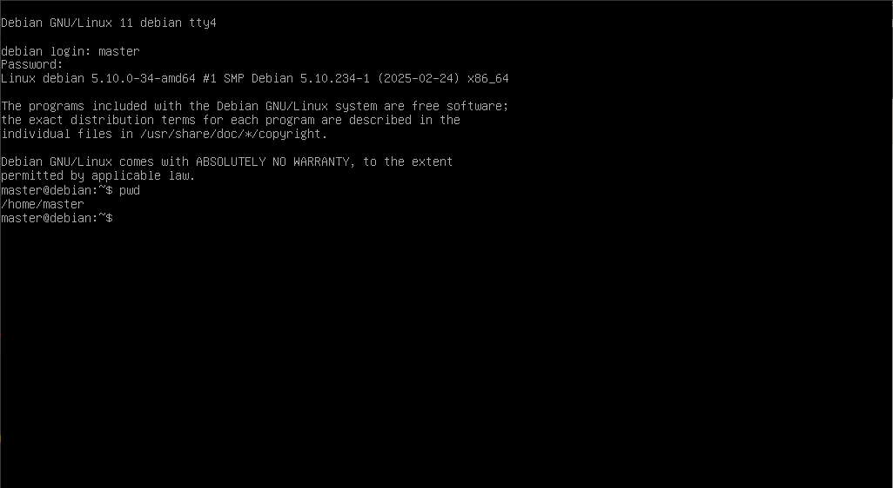

# **GNU Linux**

## Kavramlar

### Donanım (Hardware)
Donanım, bilgisayarın fiziksel bileşenlerinden oluşur. İşletim sistemi ve yazılımlar, donanımı kullanarak işlemleri gerçekleştirir. İşlemci (CPU)
Bellek (RAM)
Sabit disk, SSD
Klavye, fare, ekran kartı, yazıcı donanıma örnek verilebilir.

###  Kernel (Çekirdek)
Kernel, işletim sisteminin çekirdeğidir ve donanımla doğrudan iletişim kuran en temel bileşendir. Bilgisayarın bellek yönetimi, işlem yönetimi, dosya sistemi ve donanım sürücülerini kontrol eder.

### Shell (Kabuk)
Shell, kullanıcı ile işletim sistemi arasındaki ara yüzdür. Kullanıcının komutlarını alır, Kernel’e ileterek gerekli işlemleri başlatır.
Shell, Kernel’i doğrudan yönetmeyi kolaylaştıran bir katmandır.

### Uygulamalar
Uygulama yazılımları, kullanıcıların belirli görevleri gerçekleştirmesine olanak tanıyan programlardır. Bu yazılımlar Shell ve Kernel üzerinden çalışarak donanımı kullanır.

### İşletim Sistemi Nedir?
- Donanımlarının denetimi ve yönetiminden sorumlu yazılımdır.
- Temel sistem işlemlerinden ve programlarının çalıştırılmasından sorumludur.
- Yazılımların, donanım katmanlarına ve sisteme erişebilmesi için arayüz sunar.
- İşlem (Process) yönetiminden ve işlenme sıralarından sorumludur.
- Giriş-Çıkış (Input-Output I/O), Ağ (Network) ve Bellek (RAM) yönetimlerinden sorumludur.
- İşletim sistemleri, ‘Operating System’in kısaltması olan ‘OS’ ile gösterilir.

 

  

## **GNU**
GNU; çekirdeği, sistem araçlarını, açıcılarını, kütüphanelerini ve son kullanıcı yazılımlarını içeren, GNU Tasarısı kapsamında geliştirilen bir işletim sistemidir. İsminin açılımı "GNU's Not Unix" (GNU Unix değildir) dir. Bu ismi almasındaki sebep de tasarımının Unix'e benzerken kendisinin özgür yazılım olması ve herhangi bir UNIX kodunu içermemesidir.

GNU işletim sistemi planı 1983 Eylül'ünde Richard Stallman tarafından duyurulmuş, 1984 Ocak ayında işleyişe başlamıştır. 2025 itibarıyla GNU hâlâ etkin olarak gelişmektedir.[[1](#kaynakça)]

## **Linux** 

Linux, 1991 yılında Linus Torvalds adlı bir Fin üniversite öğrencisi tarafından, daha eski işletim sistemlerinden birisi olan UNIX'in mimarisine ve POSIX standartlarına uygun şekilde sıfırdan yazılmaya başlanmıştır. Geliştirilmesinde Unix mimarisinden esinlenilmiş olmakla birlikte Linux içinde Unix'ten alınmış herhangi bir kod bulunmamaktadır. Geliştirilen bu yazılım, kullanıcı araçları olmayan sadece bir çekirdek yazılımıdır. 
[[2](#kaynakça)]

## **GNU-Linux**
Linux’un, henüz kararlı bir işletim sistemi yoktu. Linus Torvalds bu konuda endişeliydi. İyi bir ‘çekirdek’ bulamama konusunda da benzer endişeyi o dönem, GNU işletim sisteminin kurucusu Richard Stallman yaşıyordu. Çünkü GNU’nun Hurd isimli, işlevsiz bir çekirdeği vardı. Linux’un iyi bir işletim sistemine; GNU’nun ise iyi bir çekirdeğe ihtiyacı
vardı. Richard Stallman’ın işletim sistemi olan GNU ve Linus Torvalds’ın çekirdeği Linux birleşti ve GNU/Linux ortaya çıktı. İsmi için yaygın kullanım ‘Linux’ olsa da, doğrusu GNU/Linux’tur.

## **Linux Dağıtımları (Linux Distributions)**
Linux dağıtımı Linux çekirdeği, GNU araçları ve bir masaüstü ortamının bir araya gelmesiyle, bu birlikteliği sürdürülebilir şekilde yönetecek bir yapılandırma araçları seti, yazılım güncelleme araçları vb. ile oluşturularak tam teşekküllü bir işletim sistemi haline gelen uygulamalar bütününü ifade eder.
Dağıtım kavramı, özgür yazılım felsefesinin çok alternatifli dünyasının bir sonucu olarak ortaya çıkmış, Linux'a özgü bir terimdir. 

Yaygınlıkları ve GNU/Linux dünyasına katkılarıyla öne çıkan bazı dağıtımlar vardır: Debian, Ubuntu, Red Hat, Fedora, Linux Mint, openSUSE ve Arch Linux bunlardan birkaçıdır.[[3](#kaynakça)]

Dağıtımlar, hedeflenen kullanım amacına göre ufak farklılıklar
gösterirler. Dosya-dizin yapıları, yükleme paketleri,
uygulamalar, belgeler vs gibi. Ücretli ve ücretsiz de olabilirler.

## **Linux dağıtımlarının kronolojisi**
Aşağıdan Linux dağıtımlarını , kronolojik olarak oluşturulma sıralarını ve eğer baçka bir dağıtımdan esinlenilerek oluşturulduysa hangi dağıtımı temel alarak oluşturulduklarını inceleyebilirsiniz.

[[3](#kaynakça)]

## **Masaüstü Ortamları (Desktop Environments)**
 - DE’lar, kullanıcı ile işletim sistemi arasında grafiksel olarak etkileşimi sağlayan tabanlar, yorumlayıcılardır.

 - İşletim sisteminin, amacınıza veya konforunuza uygun halde kullanımını sağlarlar.

 - DE’ların olmadığı distrolarda, işletim sistemi terminalden, komutlarla kullanılmalıdır.

 - Bir tema değildir. Temaları da kapsayan bir grafik arayüz deneyimidir.

 - Distrolar kadar bağımsızdırlar. Herhangibir distro, herhangibir DE kullanabilir.

 - Kurulum sırasında veya sonrasında değiştirilebilir. Açılışta çoktan seçmeli olarak da kullanılabilirler.

 ### Örnek Masaüstü Ortamları

**KDA plasma**

[[4](#kaynakça)]

**Gnome**

[[5](#kaynakça)]

**Mate**

[[6](#kaynakça)]

## **Linux Dizin Yapısı (Linux Directory Structure)**

Linux’ta dizin yapısı, hiyerarşik bir ağaç yapısı şeklinde düzenlenmiştir. Kök dizin (/) en üstte yer alır ve tüm dosyalar bu yapının altında bulunur. Linux'ta her şey bir dosyadır. Dizinler, aygıtlar, süreçler hatta bellek bile dosya olarak temsil edilir.
Hiyerarşik yapı sayesinde dosya sistemine erişim daha sistematik hale gelir.

| **Dizin**   | **Açıklama**  |
|------------|-------------|
| `/` (Root) | En üst düzey dizin, tüm dosya sisteminin köküdür. |
| `/bin` | Temel sistem komutları ve çalıştırılabilir dosyalar (`ls`, `cp`, `mv` vb.). |
| `/sbin` | Sistem yöneticisi komutları (`shutdown`, `fdisk`, `ifconfig` vb.). |
| `/boot` | Önyükleme dosyaları (Linux çekirdeği ve GRUB burada bulunur). |
| `/dev` | Aygıt dosyaları (HDD, USB, CD-ROM vb. `/dev/sda`, `/dev/tty1` vb.). |
| `/etc` | Konfigürasyon dosyaları (`/etc/passwd`, `/etc/hostname`, `/etc/fstab` vb.). |
| `/home` | Kullanıcıların kişisel dizinleri (`/home/kullanıcı_adı/`). |
| `/lib`, `/lib64` | Çekirdek modülleri ve sistem kütüphaneleri (`.so` dosyaları). |
| `/media` | USB, CD/DVD gibi harici aygıtların bağlandığı yer. |
| `/mnt` | Geçici olarak bağlanan dosya sistemleri için kullanılan dizin. |
| `/opt` | Üçüncü taraf yazılımlar ve uygulamalar burada bulunur. |
| `/proc` | Çalışan sistem süreçleri hakkında bilgiler (`/proc/cpuinfo`, `/proc/meminfo`). |
| `/root` | Root kullanıcısının ev dizini. (`/home/root` yerine `/root` kullanılır). |
| `/run` | Geçici sistem bilgileri, sistem açıldığında oluşturulur ve kapanınca silinir. |
| `/srv` | Sunucu verileri için kullanılır (`/srv/www`, `/srv/ftp` vb.). |
| `/sys` | Sistem donanımı ve çekirdek bilgileri (`/sys/class`, `/sys/devices` vb.). |
| `/tmp` | Geçici dosyalar için kullanılan dizin (yeniden başlatıldığında silinir). |
| `/usr` | Kullanıcı yazılımları (`/usr/bin`, `/usr/lib`, `/usr/share` vb.). |
| `/var` | Loglar, cache, e-posta gibi değişken veriler (`/var/log`, `/var/cache`). |

### **Linux'ta dizinler arasında dolaşmak için kullanılan temel komutlar**
Bu komutaları terminal veya shell ile kullanarak dizinler arasında dolaşabilirsiniz.

| **Komut**  | **Açıklama** |
|------------|-------------|
| `pwd` | Bulunduğun dizinin yolunu gösterir. |
| `ls` | Mevcut dizindeki dosya ve dizinleri listeler. |
| `ls -a` | Gizli dosyalar da dahil olmak üzere tüm dosyaları listeler. |
| `ls -l` | Dosya ve dizinleri detaylı liste formatında gösterir. |
| `cd dizin_adı` | Belirtilen dizine geçiş yapar. |
| `cd ..` | Bir üst dizine çıkar. |
| `cd /` | Kök (root) dizinine gider. |
| `cd ~` | Kullanıcının ev dizinine gider. |
| `cd -` | Önceki dizine geri döner. |

### **Dizin Yapısı ve Dosya Sistemi Hakkında Unutulmaması Gerekenler**

- Linux’ta, donanımlar dahil her şeyin dosyalar halinde olduğunu unutmayın.
- Path’ler Windows’ta \ (ters slash) ile gösterilirken; Linux’ta ise / (düz slash) ile gösterilir ve kullanılır.
- Windows’takinin aksine, dosya isimlerinde küçük-büyük harf duyarlılığı (case sensitive) vardır.
- Kullanıcı olan root ile dizin olan root’u karıştırmayın; biri kullanıcı, diğeri dizindir.
Root olan dizin / ile ifade edilir. Örn /tmp/oku.txt = “Root dizini altındaki tmp dizininde bulunan oku.txt dosyası.”
- Program dosyaları Windows’taki gibi tek bir dizin (Program Files) altında toplanmaz.
Örn; dil dosyaları /usr/share/locale altında; doküman dosyaları /usr/share/doc altında toplanabilir.
- .so dosyaları, Windows’taki .dll’ler gibi kütüphane dosyalarıdır. /lib ve /usr/lib dizininde toplanırlar.
- Home dizini, Windows’taki Users dizini işlevindedir. (Fakat Root kullanıcısının kendine ait home dizini vardır. /root/ )
- /tmp veya /var/tmp dizinleri Windows’taki Temp işlevindedir.
- Home dizini için shell’de ~ işareti kullanılır. Bu dizindeki dosyalara ~/Desktop/dosya.txt şeklindeki gibi erişilebilir.
- . (nokta) işareti, path’lerde “bulunulan mevcut konumu” ifade eder. Dosya ve dizin isimlerinde ise; gizliliği...

## **Linux Terminal Kavramı**

- Terminal, komut ekranına sahip bir Shell (Kabuk) programıdır. Terminal, bir Shell değildir.
- Kullanıcı ile Kernel (Çekirdek) arasındaki yorumlayıcı olan Shell’i kullanmamızı sağlar.
- Grafik arayüzden verilen komutların ve alınan çıktıların metinsel ortamıdır. Grafik arayüzden daha fazla komuta, işleme sahiptir.
- Terminaller birden fazladır ve tercihe bağlı olarak kullanılabilirler. Konsole, Gnome Terminal, Terminator, Xfce Terminal, Tilix popüler terminallerarasındadır.
- Terminaller kişisel tercihlere göre özelleştirilebilir.
- Terminaller olmadan da Shell kullanılabilir.

Terminal olmadan shelli kullanabilmel için konsolu kullanırız konsola geçiş yapmak için CTRL+ALT+F1-F4 bu dört tuş kombinasyonuyla konsola giriş yaparsını bu kombinasyonların ikisinde masaüztü ortamınız ve giriş sayfası bulunabilir. 

**Terminal** 

**Konsol**

### **Terminal ve Konsolda Kullanabileceğiniz Kısa Yollar**
| **Kısayol**       | **Açıklama**                                                   |
|-------------------|---------------------------------------------------------------|
| `Ctrl + A`        | İmleci satır başına götürür.                                   |
| `Ctrl + E`        | İmleci satır sonuna götürür.                                   |
| `Ctrl + B`        | İmleci bir karakter geri götürür.                              |
| `Ctrl + F`        | İmleci bir karakter ileri götürür.                             |
| `Alt + B`         | İmleci bir kelime geri götürür.                                |
| `Alt + F`         | İmleci bir kelime ileri götürür.                               |
| `Ctrl + XX`       | İmleci satır başı ile bulunduğu yer arasında gezdirir.         |
| `Alt + T`         | İfadeyi öncekiyle yer değiştirir.                              |
| `Ctrl + T`        | Karakteri öncekiyle yer değiştirir.                            |
| `Alt + U`         | İmleçten sonraki ifadeyi büyük harfe dönüştürür.               |
| `Alt + L`         | İmleçten sonraki ifadeyi küçük harfe dönüştürür.               |
| `Ctrl + U`        | İmlecin arkasındaki her şeyi keser.                            |
| `Ctrl + K`        | İmlecin önündeki her şeyi keser.                               |
| `Ctrl + Y`        | Kesilen ifadeyi yapıştırır.                                    |
| `Ctrl + S`        | Komutun çıktı akışını duraklatır.                              |
| `Ctrl + Q`        | Komutun çıktı akışını sürdürür.                                |
| `Ctrl + C`        | Çalışan komutu durdurur.                                       |
| `Ctrl + Z`        | Çalışan komutu arka planda askıya alır (suspend eder).         |
| `fg` + Enter      | Arka planda askıya alınan komutu ön plana alır.                |
| `Ctrl + L`        | Ekranı temizler (Terminalde yukarıya atar).                    |
| `Ctrl + P`        | Geçmişteki komutları geriye doğru çağırır.                     |
| `Ctrl + N`        | Geçmişteki komutları ileriye doğru çağırır.                    |
| `Ctrl + R`        | Komut geçmişinde arama yapmayı başlatır.                       |
| `Ctrl + G`        | Komut geçmişinde aramayı sonlandırır.                          |
| `Tab`             | Komutları otomatik tamamlar. İki kez basıldığında olası komutları listeler. |
| `Ctrl + D`        | Oturumu kapatır (`exit` komutu ile eşdeğer).                   |

## **KAYNAKÇA**

[**1. GNU - Wikipedia**](https://tr.wikipedia.org/wiki/GNU)

[**2. Linux - Wikipedia**](https://tr.wikipedia.org/wiki/Linux)

[**3. Linux Dağıtımı - Wikipedia**](https://tr.wikipedia.org/wiki/Linux_da%C4%9F%C4%B1t%C4%B1m%C4%B1)

[**4. KDE Plasma 5.27.0 Duyurusu**](https://kde.org/tr/announcements/plasma/5/5.27.0/)

[**5. GNOME 44 - DebugPoint**](https://www.debugpoint.com/gnome-44/)

[**6. MATE SlackBuilds**](https://mateslackbuilds.github.io/)

